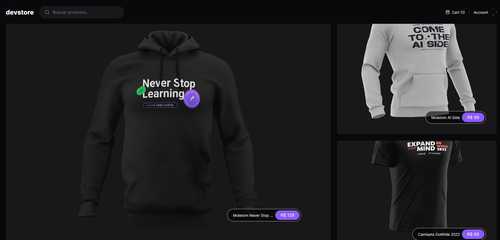

  

## 💻 Projeto
Esse projeto foi desenvolvido nas aulas da [Rocketseat](https://rocketseat.com.br).

### O que foi colocado em prática:
- Conceitos do NextJs
- Testes de interface E2E com Cypress 
- useContext
- useSearchParams

## 🚀 Tecnologias

Esse projeto foi desenvolvido com as seguintes tecnologias:

- HTML
- ReactJs
- NextJs
- TailwindCSS
- TypeScript